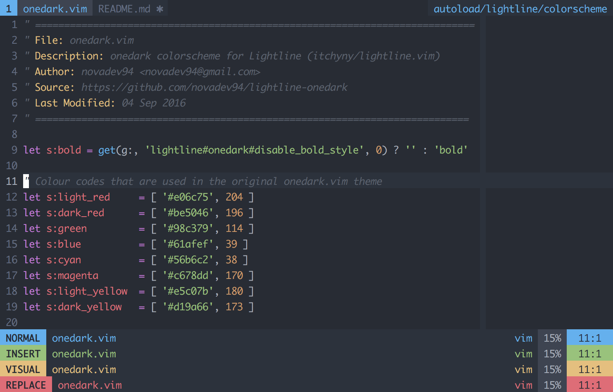

# lightline-onedark

This is an [itchyny/lightline.vim](https://github.com/itchyny/lightline.vim) theme for [joshdick/onedark.vim](https://github.com/joshdick/onedark.vim) with extra support for [bling/bufferline.vim](https://github.com/bling/bufferline.vim) integration.

All the used color codes are extracted from the original [joshdick/onedark.vim](https://github.com/joshdick/onedark.vim) theme, so the appearance should look consistent.

## Screenshot



## Installation

1. You can install this manually by putting it under `$VIM` folder or using any package manager of your choice (vim-plug, Vundle, Pathogen, NeoBundle,...)

2. Add this theme to your lightline configuration in your `.vimrc` using the theme name `onedark`.

  * If you haven't had your customized lightline configuration yet

  ```viml
  let g:lightline.colorscheme = 'onedark'
  ```

  * If you've already had one

  ```viml
  let g:lightline = {
    \ 'colorscheme': 'onedark',
    \
  }
  ```

## Configuration

### Available Options

* `g:lightline#onedark#disable_bold_style` _(Default - 0)_: Do not use bold style.

### bufferline.vim integration

Some customizations are also added to support integration with [bling/bufferline.vim](https://github.com/bling/vim-bufferline/). Other than the default `tabsel`, you can use `bufsel` (selected buffer) and `tabsep` (separator between tabs & buffers) in your lightline `component_type`.

See [Example](#example) for more details.

## Example

This is extracted from my own `.vimrc`. This also shows the integration with `bufferline`.

If you have some problems of buffers on tab line not switching properly. Please checkout my fork here [NovaDev94/bufferline](https://github.com/NovaDev94/vim-bufferline).

```viml
let g:bufferline_echo = 0
let g:bufferline_modified = ' ✱'
let g:bufferline_show_bufnr = 0
let g:bufferline_unnamed_buffer = '[No Name]'
let g:bufferline_separator = ' '
let g:bufferline_active_buffer_left = ''
let g:bufferline_active_buffer_right = ''

let g:lightline =
  \ {
  \   'colorscheme': 'onedark',
  \   'tabline': {
  \     'left': [ [ 'tabs', 'tablinesep', 'bufferline'] ],
  \     'right': [ [ 'folder' ] ]
  \   },
  \   'tab': {
  \     'active': [ 'tabnum' ],
  \     'inactive': [ 'tabnum' ]
  \   },
  \   'component_expand': {
  \     'bufferline': 'MyBufferline',
  \     'tablinesep': 'MyTablineSep'
  \   },
  \   'component_type': {
  \     'bufferline': 'bufsel',
  \     'tablinesep': 'tabsep'
  \   },
  \   'tabline_subseparator': { 'left': '', 'right': '' },
  \   'tabline_separator': { 'left': '', 'right': '' },
  \ }

function! MyTablineSep()
  return tabpagenr('$') > 1 ? ['', '●', ''] : ''
endfunction

function! MyBufferline()
  call bufferline#refresh_status()
  let buffers = [
    \   g:bufferline_status_info.before,
    \   g:bufferline_status_info.current,
    \   g:bufferline_status_info.after
    \ ]
  call map(buffers, 's:strip(v:val)')
  return buffers
endfunction
```
